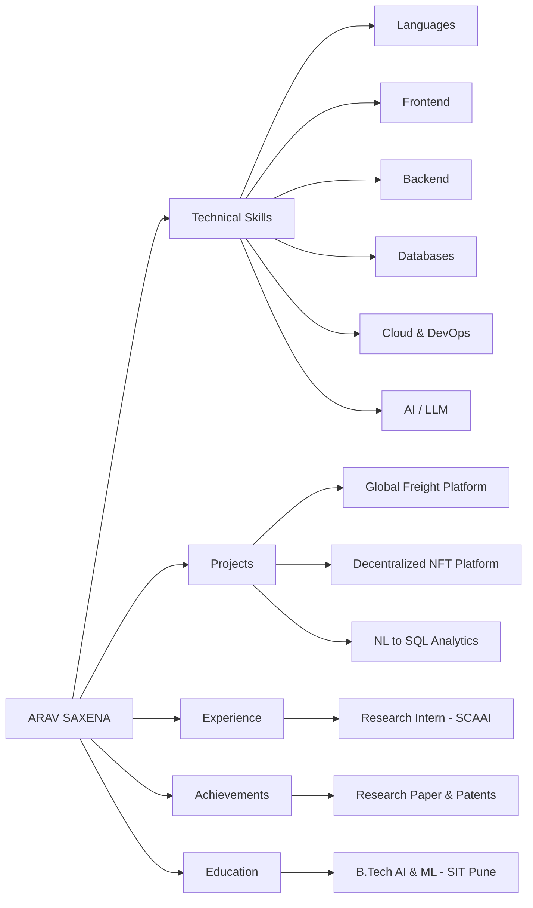

<h1 align="center">
    
   ARAV SAXENA
     
  
</h1>

  
  

  <strong>Building Scalable Systems • Intelligent Applications • Agentic AI</strong>

---

### 🎥 Portfolio Demo Video

https://github.com/arav7781/arav7781/raw/main/2026-07-19_21%3A35%3A02_video.mp4

> *Watch the full interactive portfolio experience with AI assistant in action*

---

## 📍 Quick Links
- **Email**: [aravsaxena884@gmail.com](mailto:aravsaxena884@gmail.com)
- **Phone**: [+91 96534 13126](tel:+919653413126)
- **[LinkedIn](https://linkedin.com/in/arav-saxena-a081a428a)** • **[GitHub](https://github.com/arav7781)** • **[LeetCode](https://leetcode.com/u/arav_7782/)**

---

## 👨‍💻 Profile Summary

Software engineer and full-stack developer focused on **scalable systems, intelligent applications, cloud-native engineering, and agentic AI**. My work combines robust backend architecture, modern frontend experiences, and applied LLM workflows across enterprise and research-driven projects.

---

## 🛠️ Technical Skills

### Languages
**Java** • **JavaScript** • **TypeScript** • **Python** • **SQL** • **Shell Scripting**

### Frontend
**ReactJS** • **Next.js** • **TailwindCSS** • **HTML5/CSS3** • Responsive Design

### Backend
**SpringBoot** • **NodeJS** • **ExpressJS** • **FastAPI** • **NestJS** • Microservices • REST & GraphQL

### Databases
**MySQL** • **PostgreSQL** • **MongoDB** • **Redis**

### Cloud & DevOps
**AWS** • **Azure** • **Docker** • **Kubernetes** • **CI/CD** • **Linux**

### AI & LLM
**OpenAI API** • **LangChain** • **LangGraph** • **RAG** • **AI Agents**

### Tools
**Git** • **Kafka** • **NX Monorepo** • **Postman** • **Swagger** • **Cron Jobs**

---

## 📊 Knowledge Graph of Works

